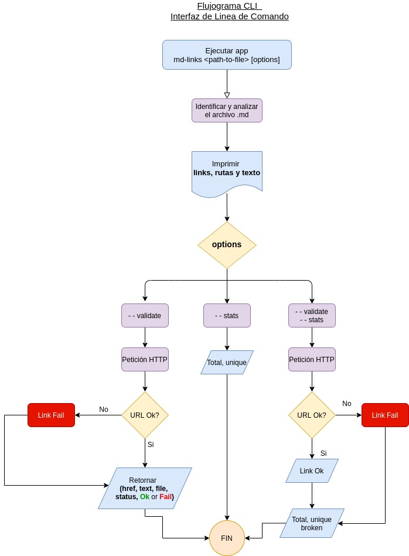
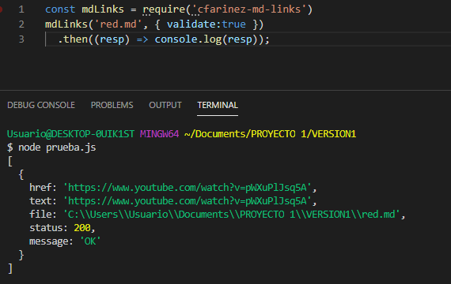
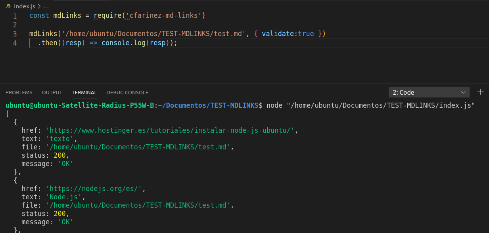
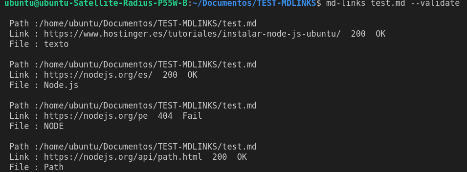
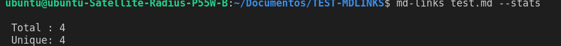
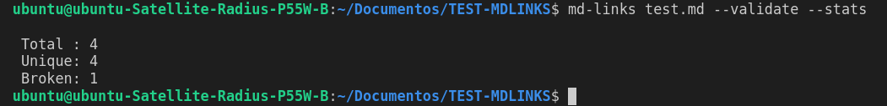

# Library Markdown Links 🚀

El objetivo práctico de este proyecto fue crear una librería (o biblioteca - library) implementada en JavaScript, y ejecutada usando Node.js, que lea y analice archivos en formato Markdown, para verificar los links que contengan y reportar algunas estadísticas.


Este proyecto se resolvio de manera individual.

Se realizo utilizando las siguientes librerías externas:
#### `"fetch-mock", "fetch-mock-jest", "glob", "marked", "node-fetch" ` 

## Diagrama de Flujo 📌




## Instalacion 📌

```js
npm install git:github.com/CarmenVictoriaFarinez/LIM012-fe-md-links
```
## Guia de Uso 📌

Se puede utilizar como módulo, importandolo tanto en Windows como en Linux Ubuntu

```js
const mdLinks = require('cfarinez-md-links')
```

### JavaScript API

El módulo puede importarse en otros scripts de Node.js y ofrece la siguiente interfaz:

#### `mdLinks(path, options)`

```js

mdLinks("./some/example.md")
  .then(links => {
    // => [{ href, text, file }]
  })
  .catch(console.error);

mdLinks("./some/example.md", { validate: true })
  .then(links => {
    // => [{ href, text, file, status, ok }]
  })
  .catch(console.error);

  ```

Probado en Windows



Probado en Linux 




### CLI (Command Line Interface - Interfaz de Línea de Comando)

Se puede utilizar a traves de lineas de comando.

#### Options

##### `--validate`

Si pasamos la opción `--validate`, el módulo debe hacer una petición HTTP para
averiguar si el link funciona o no. Si el link resulta en una redirección a una
URL que responde ok, entonces consideraremos el link como ok.

Por ejemplo:

```sh13d99df067c1
$ md-13d99df067c1
./some/example.md http://algo.com/2/3/ ok 200 Link a algo
./some/example.md https://otra-cosa.net/algun-doc.html fail 404 algún doc
./some/example.md http://google.com/ ok 301 Google
```


Vemos que el _output_ en este caso incluye la palabra `ok` o `fail` después de
la URL, así como el status de la respuesta recibida a la petición HTTP a dicha
URL.

##### `--stats`

Si pasamos la opción `--stats` el output (salida) será un texto con estadísticas
básicas sobre los links.

```sh
$ md-links ./some/example.md --stats
Total: 3
Unique: 3
```


También podemos combinar `--validate` y `--stats` para obtener estadísticas que
necesiten de los resultados de la validación.

```sh
$ md-links ./some/example.md --stats --validate
Total: 3
Unique: 3
Broken: 1
```



Tópicos: [Node.js](https://nodejs.org/en/),
[módulos (CommonJS)](https://nodejs.org/docs/latest-v0.10.x/api/modules.html),
[file system](https://nodejs.org/api/fs.html),
[path](https://nodejs.org/api/path.html),
[http.get](https://nodejs.org/api/http.html#http_http_get_options_callback),
parsing,
[markdown](https://daringfireball.net/projects/markdown/syntax), CLI,
[npm-scripts](https://docs.npmjs.com/misc/scripts),
[semver](https://semver.org/), ...


## Objetivos de aprendizaje

Recuerda colocar en esta seccion los objetivos de aprendizaje que quedaron 
pendientes de tu proyecto anterior.

### Javascript
- [ ] Uso de callbacks
- [ ] Consumo de Promesas
- [ ] Creacion de Promesas
- [ ] Modulos de Js
- [ ] Recursión

### Node
- [ ] Sistema de archivos
- [ ] package.json
- [ ] crear modules
- [ ] Instalar y usar modules
- [ ] npm scripts
- [ ] CLI (Command Line Interface - Interfaz de Línea de Comando)

### Testing
- [ ] Testeo de tus funciones
- [ ] Testeo asíncrono
- [ ] Uso de librerias de Mock
- [ ] Mocks manuales
- [ ] Testeo para multiples Sistemas Operativos

### Git y Github
- [ ] Organización en Github

### Buenas prácticas de desarrollo
- [ ] Modularización
- [ ] Nomenclatura / Semántica
- [ ] Linting

***

## Pistas / Tips

### FAQs

#### 쮺칩mo hago para que mi módulo sea _instalable_ desde GitHub?

Para que el módulo sea instalable desde GitHub solo tiene que:

- Estar en un repo público de GitHub
- Contener un `package.json` válido

Con el comando `npm install githubname/reponame` podemos instalar directamente
desde GitHub. Ver [docs oficiales de `npm install` acá](https://docs.npmjs.com/cli/install).

Por ejemplo, el [`course-parser`](https://github.com/Laboratoria/course-parser)
que usamos para la currícula no está publicado en el registro público de NPM,
así que lo instalamos directamente desde GitHub con el comando `npm install
Laboratoria/course-parser`.

### Sugerencias de implementación

La implementación de este proyecto tiene varias partes: leer del sistema de
archivos, recibir argumentos a través de la línea de comando, analizar texto,
hacer consultas HTTP, ... y todas estas cosas pueden enfocarse de muchas formas,
tanto usando librerías como implementando en VanillaJS.

Por poner un ejemplo, el _parseado_ (análisis) del markdown para extraer los
links podría plantearse de las siguientes maneras (todas válidas):

- Usando un _módulo_ como [markdown-it](https://github.com/markdown-it/markdown-it),
  que nos devuelve un arreglo de _tokens_ que podemos recorrer para identificar
  los links.
- Siguiendo otro camino completamente, podríamos usar
  [expresiones regulares (`RegExp`)](https://developer.mozilla.org/es/docs/Web/JavaScript/Guide/Regular_Expressions).
- También podríamos usar una combinación de varios _módulos_ (podría ser válido
  transformar el markdown a HTML usando algo como [marked](https://github.com/markedjs/marked)
  y de ahí extraer los link con una librería de DOM como [JSDOM](https://github.com/jsdom/jsdom)
  o [Cheerio](https://github.com/cheeriojs/cheerio) entre otras).
- Usando un _custom renderer_ de [marked](https://github.com/markedjs/marked)
  (`new marked.Renderer()`).

No dudes en consultar a tus compañeras, coaches y/o el [foro de la comunidad](http://community.laboratoria.la/c/js)
si tienes dudas existenciales con respecto a estas decisiones. No existe una
"única" manera correcta :wink:

### Tutoriales / NodeSchool workshoppers

- [learnyounode](https://github.com/workshopper/learnyounode)
- [how-to-npm](https://github.com/workshopper/how-to-npm)
- [promise-it-wont-hurt](https://github.com/stevekane/promise-it-wont-hurt)

### Otros recursos

- [Acerca de Node.js - Documentación oficial](https://nodejs.org/es/about/)
- [Node.js file system - Documentación oficial](https://nodejs.org/api/fs.html)
- [Node.js http.get - Documentación oficial](https://nodejs.org/api/http.html#http_http_get_options_callback)
- [Node.js - Wikipedia](https://es.wikipedia.org/wiki/Node.js)
- [What exactly is Node.js? - freeCodeCamp](https://medium.freecodecamp.org/what-exactly-is-node-js-ae36e97449f5)
- [쯈ué es Node.js y para qué sirve? - drauta.com](https://www.drauta.com/que-es-nodejs-y-para-que-sirve)
- [쯈ué es Nodejs? Javascript en el Servidor - Fazt en YouTube](https://www.youtube.com/watch?v=WgSc1nv_4Gw)
- [쯉implemente qué es Node.js? - IBM Developer Works, 2011](https://www.ibm.com/developerworks/ssa/opensource/library/os-nodejs/index.html)
- [Node.js y npm](https://www.genbeta.com/desarrollo/node-js-y-npm)
- [Módulos, librerías, paquetes, frameworks... 쯖uál es la diferencia?](http://community.laboratoria.la/t/modulos-librerias-paquetes-frameworks-cual-es-la-diferencia/175)
- [Asíncronía en js](https://carlosazaustre.com/manejando-la-asincronia-en-javascript/)
- [NPM](https://docs.npmjs.com/getting-started/what-is-npm)
- [Publicar packpage](https://docs.npmjs.com/getting-started/publishing-npm-packages)
- [Crear módulos en Node.js](https://docs.npmjs.com/getting-started/publishing-npm-packages)
- [Leer un archivo](https://nodejs.org/api/fs.html#fs_fs_readfile_path_options_callback)
- [Leer un directorio](https://nodejs.org/api/fs.html#fs_fs_readdir_path_options_callback)
- [Path](https://nodejs.org/api/path.html)
- [Linea de comando CLI](https://medium.com/netscape/a-guide-to-create-a-nodejs-command-line-package-c2166ad0452e)
- [Promise](https://javascript.info/promise-basics)
- [Comprendiendo Promesas en Js](https://hackernoon.com/understanding-promises-in-javascript-13d99df067c1)
- [Pill de recursión - video](https://www.youtube.com/watch?v=lPPgY3HLlhQ&t=916s)
- [Pill de recursión - repositorio](https://github.com/merunga/pildora-recursion)